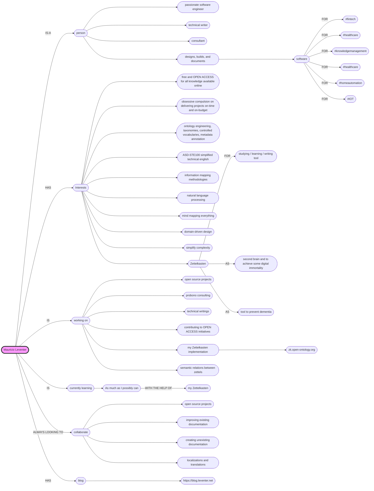

<h3 align="left">👋 Hi, I’m @mleventer</h3>

Passionate software engineer, technical writer, and consultant <i title="[in a way that expresses happiness or satisfaction]">contentedly</i> <i title="[inflicted with a wound; injured]">wounded</i> designing, building, and documenting software for: #fintech, #healthcare, #knowledgemanagement, #homeautomation, and #iot. <b>BH I ❤️ what I do.</b>
 

<h3 align="left">👀 Interests</h3> 
<ul><li><mark>free and OPEN ACCESS for all knowledge available online</mark><li>obsessive compulsion on <mark>delivering projects on-time and on-budget</mark></li><li><mark>simplify complexity</mark></li></li><li>natural language processing</li><li>ontology engineering, taxonomies, controlled vocabularies, metadata annotation</li><li><i>Zettelkasten</i></a> as a studying / learning / writing tool</li><li><i>Zettelkasten</i></a> as a second brain (and to achieve some 'digital immortality')</li><li><i>Zettelkasten</i></a> as a tool to prevent dementia</li><li>information mapping methodologies</li><li>ASD-STE100 simplified technical english</li><li>domain-driven design (DDD)</li><li>mind mapping everything</li><li>DIY my own cheese*, bread*, pizza*, and mediterranean food.</li></ul>  <i>*By the way, after my kidney surgery I'm considering not to make / eat cheese, pizza, or any salted foods again.</i>

<h3 align="left">🔭 Working on</h3>
<ul><li>open source projects</li><li>probono consulting</li><li>contributing to OPEN ACCESS initiatives</li><li>technical writings</li><li><i>Zettelkasten</i> v2. implementation @ <a href="https://zk.open-ontology.org/" target="_blank">[zk.open-ontology.org]</a></li><li>semantic relations between zettels</li></ul>

<h3 align="left">🌱 Currently learning</h3>

As much as I possibly can with the help of my <i>Zettelkasten</i>

<h3 align="left">💞️ Always looking to</h3>
<h4>Collaborate on open source projects, improving existing documentation, creating unexisting documentation, and also on localizations/translations.</h4>

<h3 align="left"> 📓 Blog</h3>

<a target="_blank" href="https://blog.leventer.net" target="_blank">https://blog.leventer.net/</a>

<h3 align="left">📫 How to reach me</h3>

<a href="https://www.linkedin.com/in/mauricioleventer/" target="_blank">&nbsp;Let's connect on LinkedIn</a>

&nbsp;
<h3 align="left">🥣 Tech soup</h3>

                                     

<!---
mleventer/mleventer is a ✨ special ✨ repository because its `README.md` (this file) appears on your GitHub profile.
You can click the Preview link to take a look at your changes.
--->
