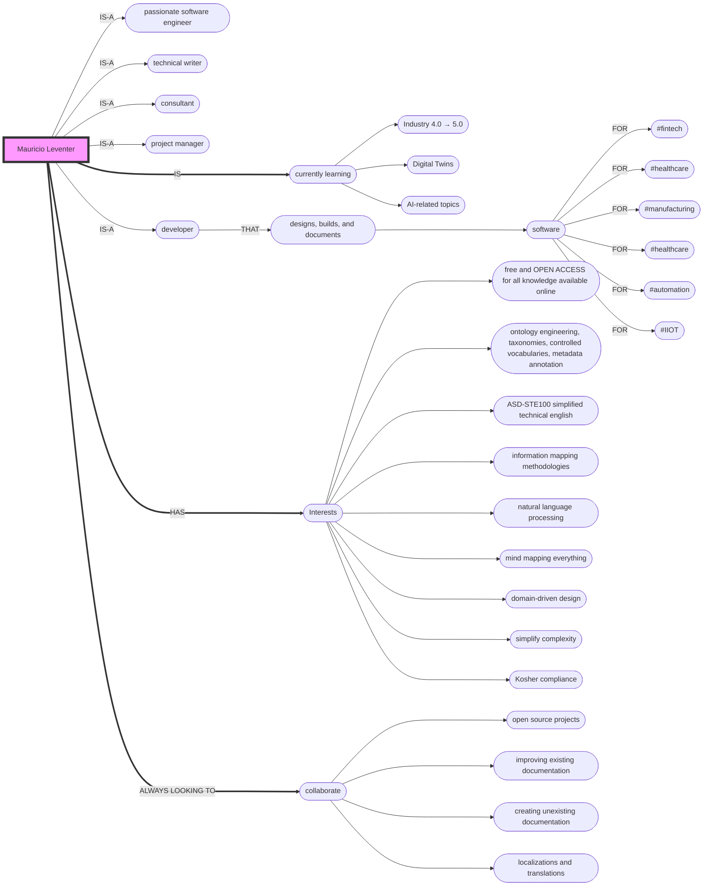

<h3 align="left">Hey 🖖, I’m @mleventer</h3>

Passionate agile project manager, developer, technical writer, and consultant <i title="[in a way that expresses happiness or satisfaction]">contentedly</i> <i title="[inflicted with a wound; injured]">wounded</i> designing, coding, building, and documenting software for: #fintech, #healthcare, #manufacturing, #automation, and #iiot.
 

<h3 align="left">👀 Interests</h3> 
<ul><li><mark>free and OPEN ACCESS for <strong>all</strong> knowledge available online</mark><li><mark>simplify complexity</mark></li></li><li>software development</li><li>ASD-STE100 simplified technical english</li><li>ontology engineering, taxonomies, controlled vocabularies, metadata annotation</li><li>information mapping methodologies</li><li>international standards</li><li>AI-powered domain-driven design (DDD) tools</li><li>Kosher compliance</li></ul> 

<h3 align="left">🌱 Currently learning</h3>

Industry 4.0 → 5.0, Digital Twins, and some AI-related topics.

<h3 align="left">💞️ Always looking to</h3>
<h4>Collaborate on open source projects, improving existing documentation, creating non-existent documentation, and also on localizations/translations.</h4>

<h3 align="left">📫 How to reach me</h3>

<a href="https://www.linkedin.com/in/mauricioleventer/" target="_blank">&nbsp;Let's connect on LinkedIn</a>

<h3 align="left">🗺️ mleventer (for visual learners):</h3>

```mermaid
flowchart LR
    A[Mauricio Leventer] -->|IS-A| A2([passionate software engineer])
    A -->|IS-A| A3([technical writer])
    A -->|IS-A| A4([consultant])
    A -->|IS-A| AA([project manager])
    A -->|IS-A| AC([developer])
    AC -->|THAT| A5([designs, builds, and documents])
    A5 ---> A6([software])
    A6 -->|FOR| A7([#fintech])
    A6 -->|FOR| A8([#healthcare])
    A6 -->|FOR| A9([#manufacturing])
    A6 -->|FOR| A10([#healthcare])
    A6 -->|FOR| A11([#automation])
    A6 -->|FOR| A12([#IIOT])    
    A ===>|HAS| B([Interests])
    B ---> I1([free and OPEN ACCESS for all knowledge available online])
    B ---> I3([ontology engineering, taxonomies, controlled vocabularies, metadata annotation])
    B ---> I4([ASD-STE100 simplified technical english])
    B ---> I5([information mapping methodologies])
    B ---> I6([natural language processing])
    B ---> I7([mind mapping everything]) 
    B ---> I8([domain-driven design]) 
    B ---> I9([simplify complexity])
    B ---> I10([Kosher compliance])
    A ===>|IS| D([currently learning])
    D --> D1([Industry 4.0 → 5.0])
    D --> D2([Digital Twins])
    D --> D3([AI-related topics])
    A ===>|ALWAYS LOOKING TO|E([collaborate])
    E ---> E1([open source projects])
    E ---> E2([improving existing documentation])
    E ---> E3([creating unexisting documentation])
    E ---> E4([localizations and translations])
    style A fill:#f9f,stroke:#333,stroke-width:5px
```

<!---
mleventer/mleventer is a ✨ special ✨ repository because its `README.md` (this file) appears on your GitHub profile.
You can click the Preview link to take a look at your changes.
--->
